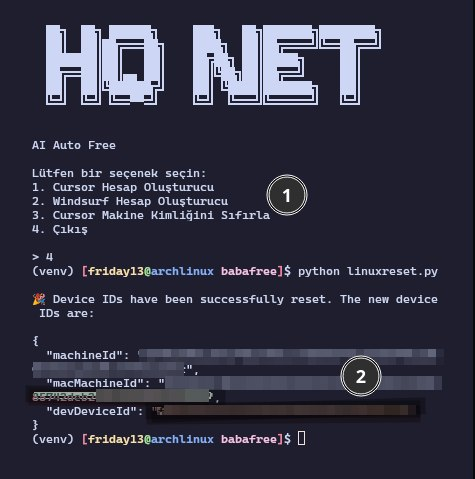

# windoZORT


# Linux - Archlinux


- new patch
- ✨ Automatic random device ID generation
- 🔄 Automatic backup of original configuration
  

# AI Auto Free

With this tool, you can use IDEs like Cursor and Windsurf without limitations.

## Building

## Package Installation

Run the following command to install required packages:

```bash
pip install -r requirements.txt
```

### Windows

To build the project:

```bash
.\build.bat
```

### Linux & MacOS

To build the project:

```bash
./build.sh
```

## Important Notice

This tool is developed for research and educational purposes only. Please use responsibly.
The developer assumes no liability for any issues that may arise from using this tool.
