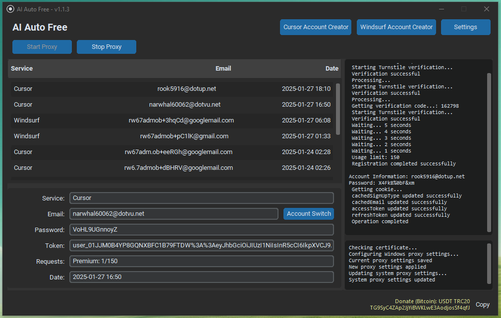

# AI Auto Free

AI Auto Free is a comprehensive automation tool that enables unlimited usage of AI-powered IDEs like Cursor and Windsurf. The project offers cross-platform support and includes multiple language capabilities.

## Important Notice
This tool is developed for research and educational purposes only. Please use responsibly. The developer assumes no liability for any issues that may arise from using this tool.

## Supported Languages

| Language |  |  |  |  |
|----------|----------|----------|----------|----------|
| English  | Русский  | 中文     | Türkçe   | Azərbaycan |

## Screenshots

### Windows

___
### Requirements:
- Make sure you have installed the latest version of the software (https://github.com/kodu67/ai-auto-free/releases/latest)
- Google Chrome browser must be installed
- You must be logged into a Cursor or Windsurf account (Required for automatic login)
- If you are using a proxy or VPN, it must be turned off
- MitmProxy: [Mitmproxy](https://mitmproxy.org/)

### Cursor Account Creator
It's fully automatic. You don't need to do anything.

### Windsurf Account Creator
The account is created automatically. When the account creation process is successfully completed, you will receive a token. This token code is automatically copied. It can be pasted with Ctrl + V.

We will use this token here:
On the Windsurf screen, press CTRL + SHIFT + P
Search and select `Windsurf: Provide Auth Token (Backup Login)` option.
A browser window will open, you can close it.
Return to the Windsurf screen and paste the token in this field. You will be logged in automatically.
___
### Settings
Browser Visibility: By default, the browser is hidden while operations are being performed. If you want to see how automatic account creation processes are done, enable this option.

Email Verifier: By default, the "Temporary" option is selected. If this option is selected, it will perform email verification using temp mail services. However, since the services we create accounts for block temp mail services, there is a chance of encountering problems. In this case, you can select the "IMAP" option.

If the IMAP option is selected, it will perform email verification using IMAP services.
___
### Common Issues
- #### Trial Limit Exceeded
```text
Too many free trial accounts used on this machine.
Please upgrade to pro. We have this limit in place
to prevent abuse. Please let us know if you believe
this is a mistake.
```

```text
You've reached your trial request limit.
```
Solution: You need to enable proxy mode.

- #### Unauthorized Request
This is an error seen on the Cursor side. It indicates that the email/email domain you are using has been blocked by Cursor services.

- #### Windsurf Registration Server is Unavailable
The Windsurf registration server may sometimes become unavailable. In this case, we have no choice but to wait for the Windsurf servers. You can try again later.

- #### Windsurf Token Not Accepted
The account creation process might not have been completed successfully. This is related to the above issue.
___
### Frequently Asked Questions
- #### What does this tool do?
IDEs like Cursor and Windsurf that help us code with artificial intelligence have limited usage in the free plan. You can use this tool to overcome this limit.

- #### If I create a new account, will my codes or conversations with AI (context) be deleted?
No, they won't be deleted.
___
### Installation Steps

You can download it from the releases section or run the application with the source code as follows:

1. Setting Up Development Environment
```bash
# Create virtual environment
python -m venv venv
source venv/bin/activate  # Linux/MacOS
venv\Scripts\activate     # Windows

# Install dependencies
pip install -r requirements.txt
```

2. Building
```bash
# Windows
.\build.bat

# Linux/MacOS
./build.sh
```
