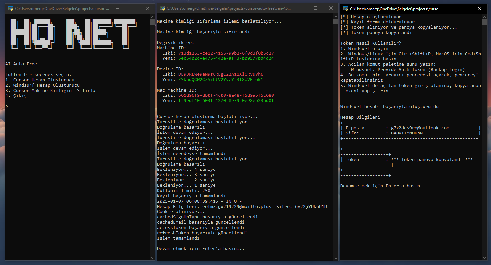
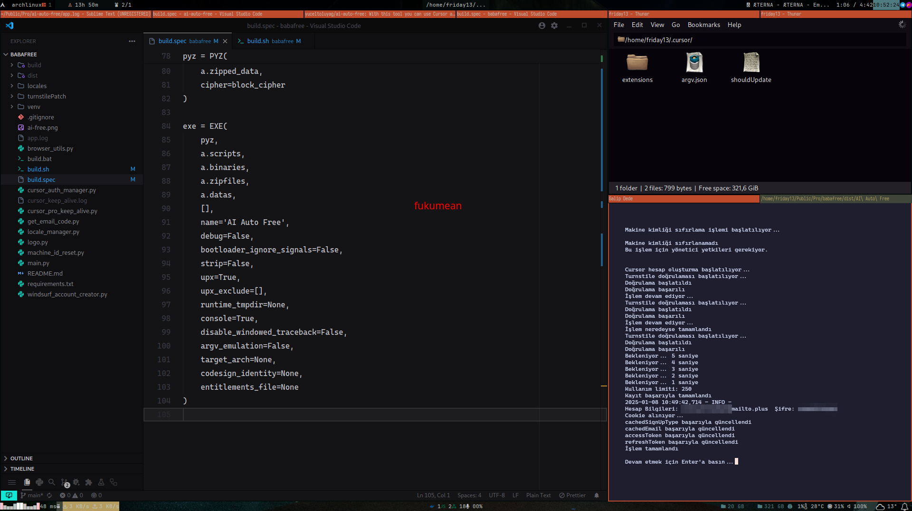

# AI Auto Free

AI Auto Free is a comprehensive automation tool that enables unlimited usage of AI-powered IDEs like Cursor and Windsurf. The project offers cross-platform support and includes multiple language capabilities.

## Supported Languages
- English
- Russian
- Chinese
- Turkish
- Azerbaijani

Download Latest Version: https://github.com/kodu67/ai-auto-free/releases/latest

## Screenshots

### Windows


### Linux - Archlinux


## Technical Architecture

### 1. Authentication System (cursor_auth_manager.py)
- SQLite database for credential management
- OS-specific configuration file handling
- Secure session token storage
- Error handling and logging system
- Platform-based database path management:
  - Windows: %APPDATA%/Cursor/User/globalStorage/state.vscdb
  - MacOS: ~/Library/Application Support/Cursor/User/globalStorage/state.vscdb
  - Linux: ~/.config/Cursor/User/globalStorage/state.vscdb

### 2. Session Management (cursor_pro_keep_alive.py)
- Automated account creation
- Turnstile CAPTCHA solver
- Session token management
- Email verification system
- Random user information generation
- Detailed error handling and retry mechanisms
- Usage limit monitoring and reporting
- Secure token storage and management
- Automated form filling and interaction systems

### 3. Browser Automation (browser_utils.py)
- Chromium-based automation (DrissionPage integration)
- Custom browser settings
- Extension management
- Cross-platform support
- Headless mode support
- Custom user agent
- Security and privacy settings
- Automatic port management

### 4. Email Verification System (get_email_code.py)
- Temporary email service integration (temp-mail.io API)
- Automated email creation
- Verification code capture and processing
- Error handling and retry mechanism
- API communication management
- Custom HTTP headers

### 5. Usage Tracking (cursor_usage.py)
- API-based usage statistics tracking
- Token-based authentication
- Model-based usage analysis
- Cache management
- Detailed error reporting
- User-based statistics collection
- API response processing and filtering

### 6. Language Management (locale_manager.py)
- JSON-based multilingual support
- Dynamic language switching
- User preference storage
- System language auto-detection
- Default language support
- Fallback translations

### 7. Machine ID Management (machine_id_reset.py)
- Machine ID reset functionality
- Device ID management
- Platform-based configuration
- Administrator privileges check
- Secure ID generation
- Process management
- Configuration file operations

### 8. Windsurf Account Management (windsurf_account_creator.py)
- Automated account creation
- Firebase integration
- Token management
- Form automation
- CAPTCHA solution
- Secure password generation
- JavaScript injection
- Clipboard integration

## System Requirements

### Software Requirements
- Python 3.x
- Chromium-based browser
- SQLite3

### Python Dependencies
```
DrissionPage==4.1.0.9
requests==2.32.3
cryptography==44.0.0
psutil==6.1.1
PyVirtualDisplay==3.0
elevate>=0.1.3
pyperclip
```

### Hardware Requirements
- Processor: x64 architecture
- RAM: Minimum 4GB recommended
- Disk: 100MB free space
- Internet connection

## Security Features

### 1. Authentication Security
- Encrypted token storage
- Secure session management
- Automatic session renewal
- Secure database access
- Machine ID protection

### 2. System Security
- Administrator privileges check
- Secure file operations
- Error catching and recovery mechanisms
- Secure cache management
- Process isolation

### 3. Browser Security
- Custom user agent
- Secure extension management
- Isolated browser sessions
- Custom security headers
- JavaScript security

## Features and Functions

### 1. Account Management
- Automated account creation
  - Random user information
  - Strong password generation
  - Email verification
- Token management
  - Session token creation
  - Token renewal
  - Token verification
- Session maintenance
  - Automatic renewal
  - Error state recovery

### 2. Automation Features
- CAPTCHA solution
  - Turnstile support
  - Automatic detection
  - Shadow DOM support
- Automated form filling
  - Smart waiting times
  - Human-like interaction
  - Element control
- Browser interactions
  - Page load control
  - Element waiting
  - JavaScript execution
- Error state recovery
  - Retry mechanisms
  - State control
  - Logging

### 3. Multi-Platform Support
- Windows compatibility
  - AppData location management
  - Windows-specific settings
  - Registry access
  - Process management
- Linux support
  - .config directory management
  - X11 support
  - System permissions
  - Process control
- MacOS support
  - Application Support directory management
  - Darwin-specific settings
  - Sandbox compatibility
  - Process management

## Development Guide

### Project Structure
```
ai-auto-free/
├── main.py                    # Main program
├── cursor_auth_manager.py     # Authentication management
├── cursor_pro_keep_alive.py   # Session maintenance
├── browser_utils.py           # Browser automation
├── cursor_usage.py           # Usage tracking
├── get_email_code.py         # Email verification
├── locale_manager.py         # Language management
├── machine_id_reset.py       # Machine ID reset
├── windsurf_account_creator.py # Windsurf account management
├── settings.json             # Configuration
├── locales/                  # Language files
├── scripts/                  # JavaScript files
├── turnstilePatch/          # CAPTCHA solver
└── requirements.txt         # Dependencies
```

### Installation Steps

1. Setting Up Development Environment
```bash
# Create virtual environment
python -m venv venv
source venv/bin/activate  # Linux/MacOS
venv\Scripts\activate     # Windows

# Install dependencies
pip install -r requirements.txt
```

2. Building
```bash
# Windows
.\build.bat

# Linux/MacOS
./build.sh
```

## Contributing
This project is open source and contributions are welcome through GitHub:
https://github.com/kodu67/ai-auto-free/

### Contribution Steps
1. Create a fork
2. Create a feature branch
3. Commit your changes
4. Open a pull request

### Code Standards
- PEP 8 compliant code
- Detailed docstring usage
- Comprehensive error handling
- Modular and reusable code
- Test coverage
- Security best practices
